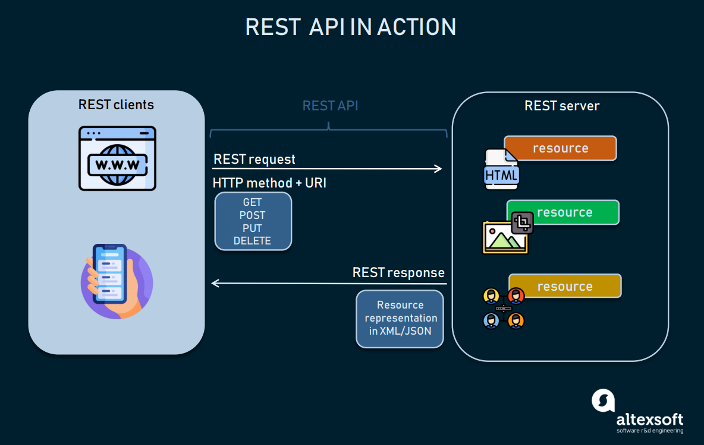

### REST API 

API（Application Programming Interface：应用程序接口）是一些预先定义的借口（如函数、HTTP接口），或指软件系统不同组成部分分衔接的约定。

RESTful于2000年由Roy Fielding首次引入，是一种**经常用于互联网服务开发（分布式超媒体系统）的架构风格和方法**。

> REST API 的完整形式是 Representational State Transfer Application Programming Interface，通常称为 Rest API Web 服务。这意味着当调用 RESTful API 时，服务器会将请求的资源*状态*的*表示**传输*到客户端系统。

### REST API 如何工作

REST确定API的结构。开发人员在构建API时必须遵守一组特定的规则。

每个URL都称为请求，而返回的数据称为响应。

REST API分解事务以生成一系列小组件。每个组件都解决事务的特定方面。

REST API利用[RFC 2616协议](http://www.cnpaf.net/Class/HTTP/200811/23277.html)描述的HTTP方法

- GET获取数据
- PUT更改数据状态
- POST创建数据
- DELETE方法来删除数据

### REST的指导原则

#### RESTful架构的六个指导原则或约束：

#### 1.统一接口

一个统一的REST接口可以通过四个约束实现：

- 资源标识：接口必须能够唯一地标识客户端和服务器之间交互中涉及的每个单独资源。
- 通过表示操作资源：资源应该在服务器响应中具有统一的标识，这些标识应该用于修改服务器中的资源状态。
- 自描述消息：每个资源标识应该携带足够的信息来描述如何处理消息。它还应该提供可以对资源执行的附加操作的信息。
- 超媒体作为应用程序状态的引擎：客户端应该只有应用程序的初始URI。所有其他资源和交互由客户端应用程序使用超链接动态驱动。

#### 2.客户端服务器（C-S架构）

这一设计原则基于客户端和服务器应该彼此隔离并允许独立开发的概念。通过将前后端分离，提高了客户端跨多个平台移植性，并通过简化服务器组件提高了可扩展性。

#### 3.无状态

无状态是强制性的，从客户端到服务器的每个请求都必须包含解释和完成请求所需的所有信息。

服务器无法利用任何之前存储在服务器上的上下文信息；因此，会话状态完全保留在客户端。

#### 4.可缓存

由于无状态API可以通过管理大量入站和出战调用来增加请求开销，因此REST API 设计应该能够存储可缓存的数据。根据这个API设计原则，响应中 的数据应该间接或明确的归类为可缓存或不可缓存。

如果响应是可缓存的，则客户端缓存有权在将来为类似请求回收该响应数据。

#### 5.分层系统

分层系统风格通过约束组件行为允许架构由分层组成；在分层系统中，每个组件都无法看到与其交互的直接层之外的内容。

#### 6.按需编码、可定制代码

REST还允许通过下载和执行小程序或脚本形式的代码来扩展客户端功能。

这通过减少药预先实现的功能数量来简化客户端。服务器可以将部分功能以代码的形式提供给客户端，客户端只需要执行代码即可。

> 与其他架构风格一样，REST有自己的指导原则和约束。如果需要将服务器接口定义为RESTful，就必须要满足这些原则。

#### REST 和 HTTP 不一样

> REST != HTTP

由于REST打算使用互联网更加精简和标准化，Roy fielding提倡更严格地使用REST原则。

